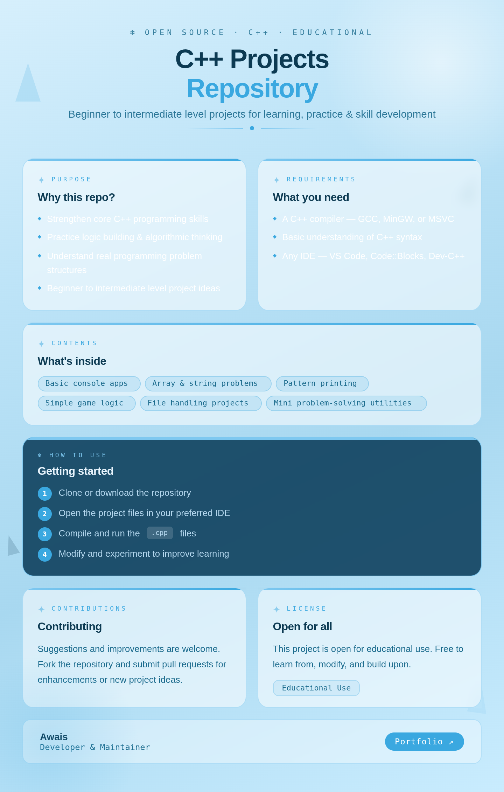

<h1 align="center">🧊 C++ Projects Repository</h1>

<h3 align="center">
  Built & Maintained by <b>CH AWAIS</b> 🇵🇰
</h3>

<p align="center">
  
  
  
</p>

---

## 👋 About the Author

<table>
  <tr>
    <td>👤 <b>Name</b></td>
    <td>CH Muhammad Awais</td>
  </tr>
  <tr>
    <td>🎓 <b>Field</b></td>
    <td>BS Cybersecurity | MERN Stack Developer</td>
  </tr>
  <tr>
    <td>📞 <b>Contact</b></td>
    <td><b>0314-3433665</b></td>
  </tr>
  <tr>
    <td>🌐 <b>Portfolio</b></td>
    <td><a href="https://awaisweb.vercel.app">awaisweb.vercel.app</a></td>
  </tr>
  <tr>
    <td>💬 <b>Email</b></td>
    <td><a href="mailto:awais.develper@gmail.com">awais.develper@gmail.com</a></td>
  </tr>
  <tr>
    <td>🔗 <b>LinkedIn</b></td>
    <td><a href="https://www.linkedin.com/in/muhammad-awais-4a5739374">muhammad-awais</a></td>
  </tr>
</table>

---

## 📌 Overview

This repository contains a collection of **C++ projects** designed for learning, practice, and skill development.  
The projects focus on **fundamental programming concepts**, data structures, and problem-solving using C++.

---

## 🎯 Purpose

- ✅ Strengthen core **C++ programming skills**
- ✅ Practice **logic building** and algorithmic thinking
- ✅ Provide **beginner to intermediate** level project ideas
- ✅ Help understand how **real programming problems** are structured and solved

---


## ⚙️ Requirements

To run these projects, you need:

```bash
✔ A C++ Compiler   →  GCC / MinGW / MSVC
✔ Basic C++ Knowledge
✔ Any IDE           →  VS Code / Code::Blocks / Dev-C++
```

---

## 🚀 How to Use

```bash
# Step 1 — Clone the repository
git clone https://github.com/Muhammad-Awais123/cpp-projects.git

# Step 2 — Open in your IDE

# Step 3 — Compile any .cpp file
g++ filename.cpp -o output

# Step 4 — Run the program
./output
```

> 💡 *Modify and experiment with the code to improve your learning!*

---

## 🤝 Contribution

Suggestions and improvements are **always welcome!**

- 🍴 Fork the repository
- 🌿 Create a new branch
- ✏️ Make your changes
- 📬 Submit a Pull Request

---


## 📞 Get in Touch

| Platform | Link |
|---|---|
| 🌐 Portfolio | [awaisweb.vercel.app](https://awaisweb.vercel.app) |
| 📱 Phone | **0314-3433665** |
| 💬 Email | [awais.develper@gmail.com](mailto:awais.develper@gmail.com) |
| 🔗 LinkedIn | [muhammad-awais](https://www.linkedin.com/in/muhammad-awais-4a5739374) |

---

<p align="center">
  <b>⚡ Keep Learning | Keep Building | Stay Secure ⚡</b>
  <br/><br/>
  <i>✨ Thanks for visiting this repository! ✨</i>
</p>





## License
This project is open for educational use.
